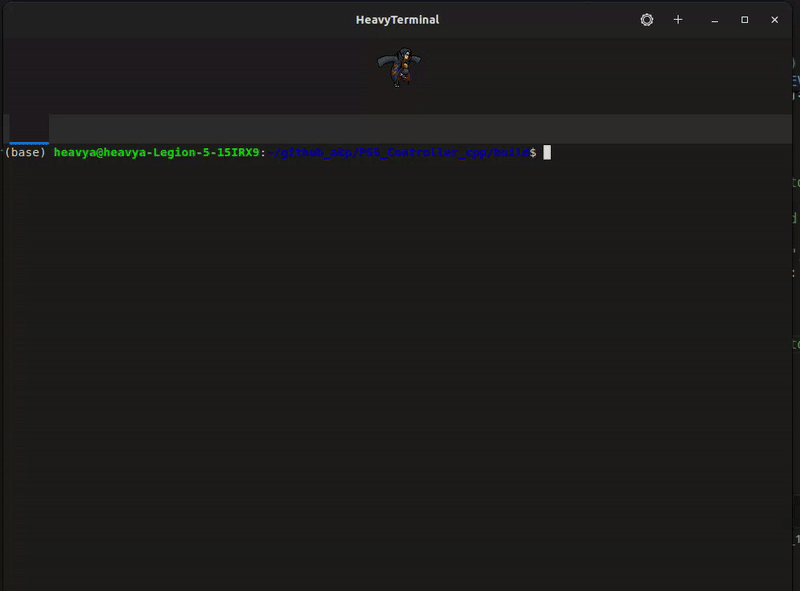

# PS5_Controller_cpp

**PS5_Controller_cpp** is a C++ library to interface with the PlayStation 5 DualSense controller on PC via Bluetooth.

## 🚀 Features

- Connect via Bluetooth (HID)
- Read analog sticks, triggers, digital buttons, touchpad inputs

## DEMO
<p align="center">
  
</p>

## 📦 Getting Started

### Prerequisites

- C++14 (or later) compiler
- HIDAPI library installed (Linux: `sudo apt install libhidapi-dev`)

### Build Instructions

```bash
git clone https://github.com/ayushkumar8340/PS5_Controller_cpp.git
cd PS5_Controller_cpp
mkdir build && cd build
cmake ..
make -j 
```

### Running the Sample
```bash
./test_controller 
```

### Output Data packet
```bash 
typedef struct
{
    MetaData data; // contains data related to the controller
    Axis left_stick; // left stick analog data
    Axis right_stick; // right stick analog data
    Axis dpad; // DPAD values
    
    Sides triggers; // trigger analog values
    Sides bumpers; // bumpers values
    Sides sticks; // L3 & R3 button values
    int buttons[6]; // X, O , traingle and square button inputs

}ControllerData;

```